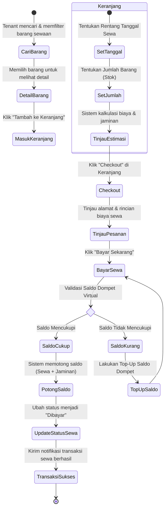
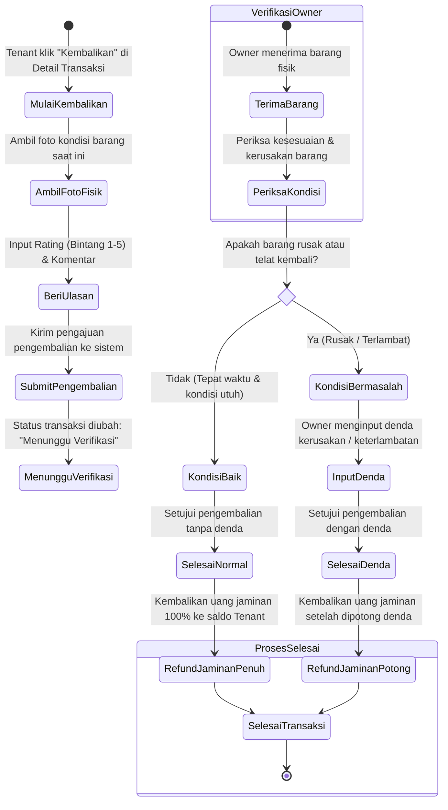
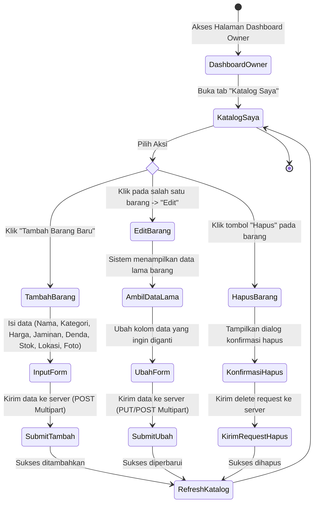

# DIAGRAM AKTIVITAS (ACTIVITY DIAGRAM): **SEWAIN**

Dokumen ini memuat Diagram Aktivitas yang menggambarkan alur kerja (workflow) proses bisnis utama pada aplikasi **Sewain**, mulai dari proses penyewaan hingga pengembalian barang.

---

## 1. Alur Penyewaan Barang (Booking & Payment Workflow)

Diagram ini menunjukkan langkah-langkah yang dilakukan oleh Penyewa (Tenant) sejak mencari barang hingga menyelesaikan pembayaran menggunakan saldo dompet virtual.

---

## 2. Alur Pengembalian Barang & Verifikasi (Return & Verification Workflow)

Diagram ini menggambarkan alur ketika Penyewa mengembalikan barang sewaan dan Pemilik Barang (Owner) memverifikasi kondisi barang serta denda yang berlaku.

---

## 3. Alur Manajemen Katalog oleh Pemilik (CRUD Catalog Workflow)

Diagram ini menggambarkan alur bagaimana Pemilik Barang (Owner) mengelola produk yang disewakan ke dalam katalog aplikasi.

