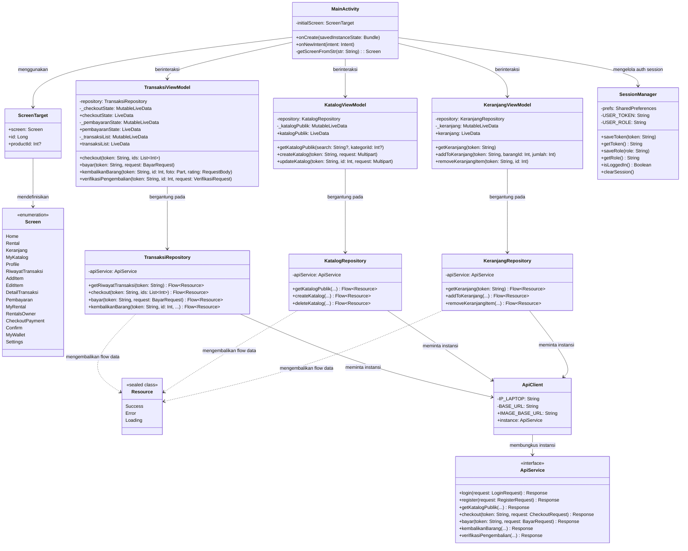

# DIAGRAM KELAS (CLASS DIAGRAM): **SEWAIN**

Dokumen ini memuat Diagram Kelas (Class Diagram) yang menggambarkan struktur class utama di aplikasi Android **Sewain**, berfokus pada hubungan arsitektural MVVM (Model-View-ViewModel), Repository, Utility, dan Jaringan (Retrofit).

---

## 1. Diagram Kelas (Mermaid)

---

## 2. Keterangan Hubungan Antar Komponen

1.  **View (MainActivity) ke ViewModel**: `MainActivity` bertindak sebagai container utama yang menginisialisasi serta memanggil aksi dari `TransaksiViewModel`, `KatalogViewModel`, dan `KeranjangViewModel` berdasarkan halaman (*Screen*) Jetpack Compose yang sedang aktif.
2.  **ViewModel ke Repository**: ViewModel bertugas menampung state UI. ViewModel memanggil fungsi repository di dalam `viewModelScope` (Coroutine) untuk memproses data secara asinkron.
3.  **Repository ke ApiClient / ApiService**: Repository memanggil API backend Laravel melalui `ApiClient.instance` yang bertipe interface `ApiService` (Retrofit).
4.  **Resource Wrapper**: Repository membungkus hasil respons HTTP (`Retrofit.Response`) ke dalam kelas *sealed* `Resource` (bisa bertipe `Success`, `Error`, atau `Loading`), memancarkannya (`emit`) melalui Kotlin Flow ke ViewModel, lalu diamati oleh UI Compose untuk penanganan status loading dan error secara reaktif.
5.  **SessionManager**: Menggunakan `SharedPreferences` Android secara independen untuk persistensi token JWT (`Bearer token`) dan otorisasi role pengguna, yang dibaca oleh `MainActivity` dan dikirim sebagai header `Authorization` pada pemanggilan API.
