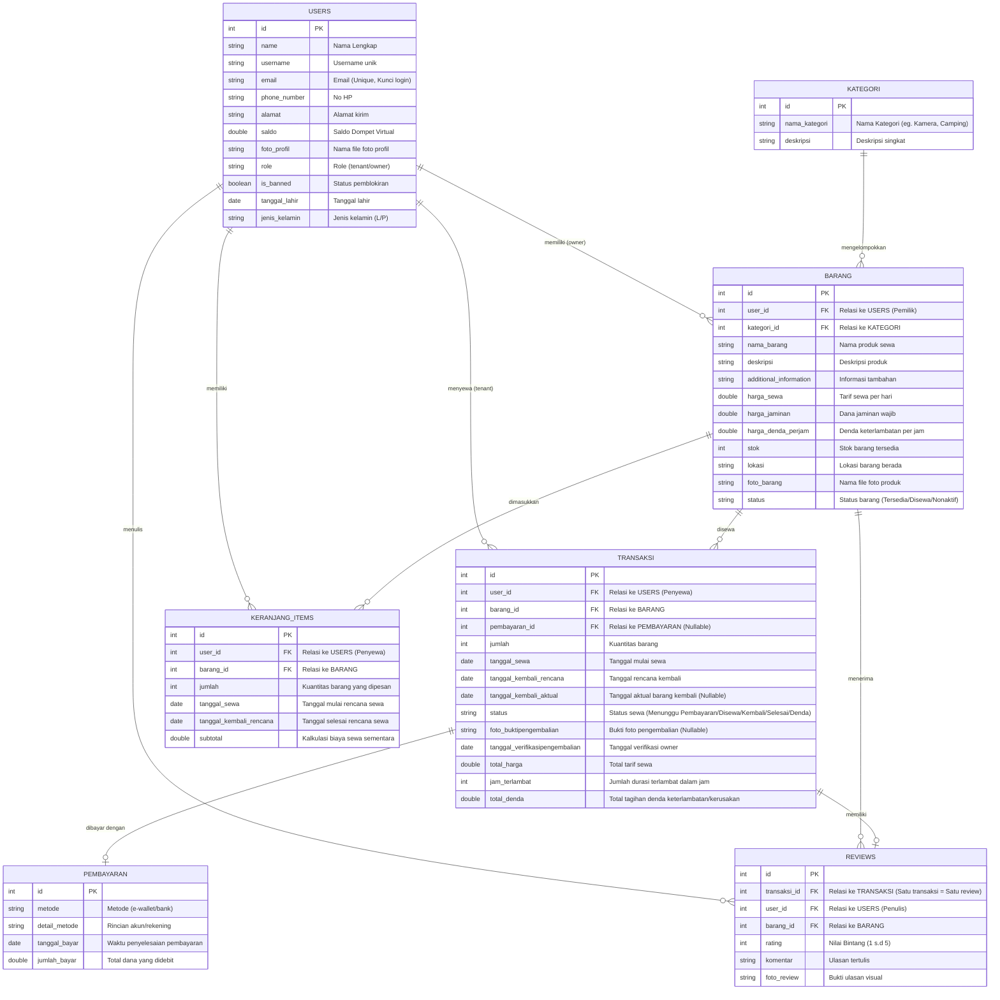

# ENTITY RELATIONSHIP DIAGRAM (ERD): **SEWAIN**

Dokumen ini memuat Entity Relationship Diagram (ERD) database relasional dari sistem aplikasi backend **Sewain**, yang dirancang untuk mendukung operasional multi-owner dan multi-tenant.

---

## 1. Diagram ERD 

---

## 2. Kardinalitas & Aturan Bisnis Relasi Database

1.  **USERS ke BARANG (1 to Many)**:
    *   Satu user (sebagai Owner) dapat memiliki dan mendaftarkan **banyak** barang di katalog.
    *   Satu barang hanya didaftarkan oleh **satu** user.
2.  **KATEGORI ke BARANG (1 to Many)**:
    *   Satu kategori (misal: "Kamera") dapat mencakup **banyak** barang.
    *   Satu barang hanya terikat pada **satu** kategori utama.
3.  **USERS ke TRANSAKSI (1 to Many)**:
    *   Satu user (sebagai Tenant/Penyewa) dapat melakukan **banyak** transaksi sewa dari waktu ke waktu.
    *   Satu transaksi hanya dibuat oleh **satu** user penyewa.
4.  **BARANG ke TRANSAKSI (1 to Many)**:
    *   Satu barang dapat disewa dalam **banyak** transaksi (berbeda waktu/penyewa).
    *   Satu baris transaksi hanya mengaitkan **satu** spesifik barang.
5.  **TRANSAKSI ke PEMBAYARAN (Many to 1 atau 1 to 1)**:
    *   Setiap transaksi sewa yang terbayar terikat dengan **satu** catatan pembayaran. Kolom `pembayaran_id` bersifat nullable karena transaksi baru belum dibayar.
6.  **TRANSAKSI ke REVIEWS (1 to 1)**:
    *   Setiap transaksi penyewaan yang sukses diselesaikan hanya dapat menghasilkan **satu** ulasan/review barang untuk mencegah spam ulasan ganda.
