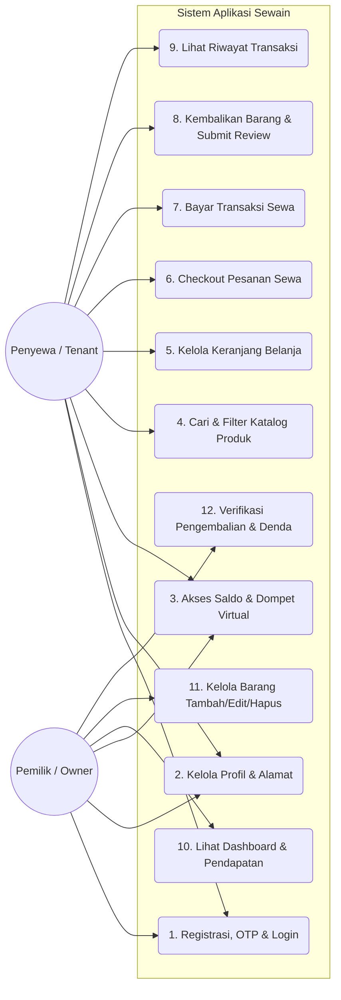

# DIAGRAM USE CASE: **SEWAIN**

Dokumen ini memuat diagram Use Case beserta penjelasan rinci mengenai aktor dan fungsionalitas utama pada sistem aplikasi **Sewain**.

---

## 1. Diagram Use Case 

---

## 2. Aktor Sistem (Actors)

| Aktor | Peran & Deskripsi |
| :--- | :--- |
| **Penyewa (Tenant)** | Pengguna yang menyewa barang milik orang lain. Memiliki kemampuan mencari katalog, mengelola keranjang, melakukan pembayaran, menerima barang, serta mengembalikan barang setelah masa sewa berakhir. |
| **Pemilik (Owner)** | Pengguna yang menyewakan barang miliknya ke publik. Memiliki kemampuan mengunggah produk ke katalog, memantau statistik pendapatan melalui dashboard, serta memeriksa dan menyetujui pengembalian barang dari penyewa. |

---

## 3. Spesifikasi Fungsional Use Case

### A. Fitur Bersama (Common Features)
1.  **Registrasi, OTP & Login (UC-01)**
    *   **Deskripsi**: Pengguna baru melakukan pendaftaran akun, memverifikasi alamat email menggunakan kode OTP (One-Time Password) yang dikirim ke email, dan masuk ke aplikasi untuk memperoleh token JWT.
2.  **Kelola Profil & Alamat (UC-02)**
    *   **Deskripsi**: Mengubah data profil diri (nama lengkap, username, nomor telepon, tanggal lahir, jenis kelamin, alamat, foto profil).
3.  **Akses Saldo & Dompet Virtual (UC-03)**
    *   **Deskripsi**: Memantau saldo digital di dalam akun. Tenant menggunakannya untuk membayar jaminan dan sewa, sedangkan Owner menggunakannya untuk menerima pendapatan dan menarik dana ke rekening bank.

### B. Sisi Penyewa (Tenant Side)
4.  **Cari & Filter Katalog Produk (UC-04)**
    *   **Deskripsi**: Menelusuri seluruh katalog barang publik, menyaring barang berdasarkan kategori tertentu, melakukan pencarian berdasarkan nama, lokasi, dan tanggal ketersediaan.
5.  **Kelola Keranjang Belanja (UC-05)**
    *   **Deskripsi**: Memasukkan barang ke dalam keranjang, memperbarui jumlah barang, menentukan tanggal awal sewa dan rencana tanggal pengembalian, serta menghapus barang dari keranjang.
6.  **Checkout Pesanan Sewa (UC-06)**
    *   **Deskripsi**: Melakukan penguncian transaksi sewa atas barang-barang yang dipilih di keranjang, memasukkan rincian pengiriman, dan menghasilkan draf transaksi pembayaran.
7.  **Bayar Transaksi Sewa (UC-07)**
    *   **Deskripsi**: Menyelesaikan transaksi dengan memotong saldo dompet virtual penyewa (mencakup biaya sewa harian dan dana jaminan).
8.  **Kembalikan Barang & Submit Review (UC-08)**
    *   **Deskripsi**: Mengajukan pengembalian barang setelah masa sewa habis dengan mengunggah foto bukti fisik barang, memberikan penilaian rating (bintang 1-5), dan ulasan tertulis.
9.  **Lihat Riwayat Transaksi (UC-09)**
    *   **Deskripsi**: Memantau daftar transaksi penyewaan aktif maupun transaksi masa lalu lengkap dengan status pembayaran dan pengiriman.

### C. Sisi Pemilik (Owner Side)
10. **Lihat Dashboard & Pendapatan (UC-10)**
    *   **Deskripsi**: Memantau statistik kinerja toko, total pendapatan yang diperoleh, total barang terdaftar, serta ringkasan saldo berjalan yang bisa ditarik.
11. **Kelola Barang (Tambah/Edit/Hapus) (UC-11)**
    *   **Deskripsi**: Mendaftarkan barang baru dengan detail (kategori, nama, deskripsi, harga sewa, harga jaminan, harga denda per jam jika telat, stok, lokasi, dan foto barang), memperbarui detail, atau menghapus barang dari katalog aktif.
12. **Verifikasi Pengembalian & Denda (UC-12)**
    *   **Deskripsi**: Memeriksa fisik dan kesesuaian barang setelah dikembalikan oleh penyewa. Owner berhak menentukan denda kerusakan tambahan jika kondisi barang rusak atau berkurang kualitasnya.
